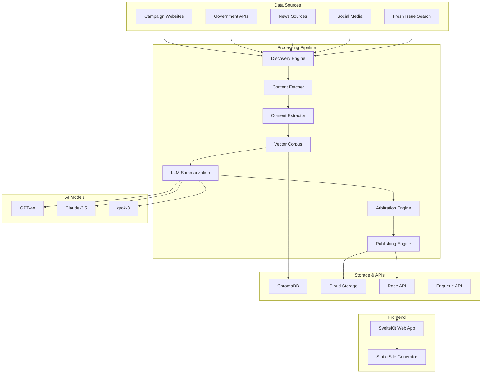

# SmarterVote Architecture v1.1

**Corpus-First AI Pipeline for Electoral Analysis** 🏗️

*Last updated: August 2025*

## 🎯 Overview

SmarterVote implements a sophisticated **corpus-first architecture** that prioritizes content comprehension and semantic understanding over simple aggregation. Our system processes electoral data through a multi-stage AI pipeline designed for accuracy, bias reduction, and scalable analysis.

The **pipeline client** (`pipeline_client/backend`) serves as the official execution engine, providing HTTP endpoints and a CLI for orchestrating pipeline steps.

## 🔧 System Architecture

### Core Design Principles

1. **Corpus-First Processing**: Build comprehensive content understanding before analysis
2. **Multi-Model Consensus**: Triangulate across multiple AI models for reliability
3. **Confidence Scoring**: Quantify certainty in analysis results
4. **Semantic Indexing**: Vector-based content search and retrieval
5. **Modular Pipeline**: Independent, testable processing stages

### Architecture Diagram



## 🚀 Pipeline Components (v1.1)

### 1. Discovery Engine (`pipeline/app/discover/`)
**Purpose**: Intelligent content source identification

**Capabilities**:
- Seed URL expansion from candidate websites
- Google Search API integration with specialized dorks
- Fresh issue-specific search for current positions
- Social media and news source detection
- Source quality scoring and prioritization

**Output**: Validated source list with metadata

### 2. Content Fetcher (`pipeline/app/fetch/`)
**Purpose**: Robust content acquisition with error handling

**Capabilities**:
- Multi-protocol support (HTTP/HTTPS, APIs)
- Rate limiting and respectful crawling
- Content type detection and handling
- Retry logic with exponential backoff
- Content integrity verification (checksums)

**Output**: Raw content with metadata

### 3. Content Extractor (`pipeline/app/extract/`)
**Purpose**: Transform raw content into structured text

**Capabilities**:
- HTML parsing with semantic awareness
- PDF text extraction with layout preservation
- JSON/XML structured data processing
- Image OCR for embedded text
- Content cleaning and normalization

**Output**: Clean, searchable text content

### 4. Vector Corpus (`pipeline/app/corpus/`)
**Purpose**: Semantic content indexing and retrieval

**Technology**: ChromaDB vector database
**Capabilities**:
- Embedding generation for semantic search
- Multi-dimensional content indexing
- Similarity-based content retrieval
- Context-aware content clustering
- Efficient vector similarity queries

**Output**: Indexed content corpus with semantic search

### 5. LLM Summarization Engine (`pipeline/app/summarise/`)
**Purpose**: Multi-model content analysis and summarization

**AI Models (Cheap Mode - Default)**:
- **GPT-4o-mini**: Cost-effective general analysis
- **Claude-3-Haiku**: Fast structured content analysis
- **Grok-3-mini**: Alternative perspective on a budget

**AI Models (Standard Mode)**:
- **GPT-4o**: General analysis and reasoning
- **Claude-3.5**: Structured content analysis
- **grok-3**: Alternative perspective and fact-checking

**Mode Selection**:
- Cheap mode (default): Cost-effective processing with mini models
- Standard mode: High-quality analysis with premium models
- Configurable via `--full-models` flag or `SMARTERVOTE_CHEAP_MODE=false` environment variable

**Process**:
1. RAG (Retrieval-Augmented Generation) query preparation
2. Parallel analysis across all models
3. Issue-specific position extraction
4. Evidence citation and sourcing

**Output**: Structured candidate positions per canonical issue

### 6. Arbitration Engine (`pipeline/app/arbitrate/`)
**Purpose**: Consensus-building and confidence scoring using AI analysis

**AI Models**: Inherits mode setting from summarization engine
- Cheap (default): Uses GPT-4o-mini, Claude-3-Haiku, Grok-3-mini for arbitration
- Standard: Uses GPT-4o, Claude-3.5, grok-3 for arbitration

**Arbitration Logic**:
- **AI-Driven Analysis**: Uses LLMs for bias detection and consensus generation
- **2-of-3 Consensus**: Majority agreement for high confidence
- **Partial Consensus**: Single agreement for medium confidence
- **No Consensus**: Store all perspectives with low confidence
- **Evidence Weighting**: Source quality affects final scoring

**Confidence Levels**:
- **HIGH**: 85%+ model agreement with quality sources
- **MEDIUM**: 60-84% agreement or limited sources
- **LOW**: <60% agreement or contradictory information

**Output**: Arbitrated positions with confidence metrics

### 7. Publishing Engine (`pipeline/app/publish/`)
**Purpose**: Generate standardized output formats

**Capabilities**:
- RaceJSON v0.2 format generation
- Multi-destination publishing (Cloud Storage, APIs)
- Data validation and quality checks
- Versioning and audit trails
- Webhook notifications

**Output**: Published race data in standardized format

## 🌐 Services Architecture

### Enqueue API (`services/enqueue-api/`)
**Technology**: FastAPI + Cloud Run
**Purpose**: Public API for triggering race processing

**Endpoints**:
- `POST /enqueue`: Submit race for processing
- `GET /health`: Service health check
- `GET /metrics`: Processing metrics

**Features**:
- Pub/Sub integration for async processing
- Request validation and sanitization
- Rate limiting and authentication
- CORS configuration for web access

### Races API (`services/races-api/`)
**Technology**: FastAPI + Cloud Run
**Purpose**: Serve processed race data

**Endpoints**:
- `GET /races`: List available races
- `GET /races/{race_id}`: Get specific race data
- `GET /races/{race_id}/candidates`: Get candidate details
- `POST /webhook`: Handle processing completion

**Features**:
- Data caching and optimization
- Version management
- Content delivery optimization

## 💻 Web Frontend Architecture

### SvelteKit Application (`web/`)
**Technology**: SvelteKit + TypeScript + Tailwind CSS

**Architecture Features**:
- **Static Site Generation**: Pre-built pages for optimal performance
- **Component-Based Design**: Reusable UI components
- **Type Safety**: Full TypeScript integration
- **Responsive Design**: Mobile-first approach
- **SEO Optimization**: Structured data and meta tags

**Key Routes**:
- `/`: Homepage with featured races
- `/about`: Platform information and methodology
- `/races/[slug]`: Dynamic race-specific pages
- `/api/`: Client-side API integration

**Performance Optimizations**:
- Code splitting and lazy loading
- Image optimization and CDN delivery
- Minimal JavaScript footprint
- Progressive enhancement approach

## ☁️ Cloud Infrastructure

### Google Cloud Platform Architecture

**Compute Services**:
- **Cloud Run Services**: Auto-scaling API endpoints
- **Cloud Run Jobs**: Batch processing workers
- **Cloud Scheduler**: Automated pipeline triggers

**Storage Services**:
- **Cloud Storage**: File storage with lifecycle management
- **Secret Manager**: Encrypted API key storage
- **Firestore**: Metadata and configuration storage

**Messaging & Events**:
- **Pub/Sub**: Async job queuing and event handling
- **Dead Letter Queues**: Failed job recovery
- **Cloud Scheduler**: Automated daily processing

**Security & Monitoring**:
- **IAM**: Principle of least privilege access
- **Cloud Logging**: Centralized log aggregation
- **Error Reporting**: Automated error tracking
- **Cloud Monitoring**: Performance and health metrics

## 📊 Data Flow Architecture

### End-to-End Processing Flow

```
Electoral Race Input
        ↓
1. Discovery Phase
   - Seed URLs → Google Search → Fresh Issue Search
   - Source validation and scoring
        ↓
2. Content Acquisition
   - Parallel fetching with rate limiting
   - Content type detection and processing
        ↓
3. Content Processing
   - HTML/PDF extraction → Plain text
   - Content cleaning and normalization
        ↓
4. Corpus Building
   - Vector embedding generation
   - ChromaDB indexing and storage
        ↓
5. AI Analysis Phase
   - RAG query preparation
   - Parallel LLM processing (GPT-4o, Claude-3.5, grok-3)
   - Issue-specific position extraction
        ↓
6. Consensus & Arbitration
   - Cross-model comparison
   - Confidence scoring calculation
   - Evidence validation
        ↓
7. Publication
   - RaceJSON v0.2 generation
   - Multi-destination publishing
   - Web frontend update
        ↓
Voter-Ready Analysis
```

## 🔧 Technology Stack

### Backend Technologies
| Component | Technology | Version | Purpose |
|-----------|------------|---------|---------|
| Pipeline Runtime | Python | 3.10+ | Core processing logic |
| Data Validation | Pydantic | 2.5+ | Schema validation |
| Vector Database | ChromaDB | 0.4+ | Semantic search |
| API Framework | FastAPI | 0.104+ | REST API services |
| Task Queue | Pub/Sub | GCP | Async processing |

### Frontend Technologies
| Component | Technology | Version | Purpose |
|-----------|------------|---------|---------|
| Framework | SvelteKit | 2.x | Web application |
| Language | TypeScript | 5.x | Type safety |
| Styling | Tailwind CSS | 3.x | Responsive design |
| Build Tool | Vite | 5.x | Development & bundling |
| Runtime | Node.js | 22+ | JavaScript execution |

### Infrastructure Technologies
| Component | Technology | Version | Purpose |
|-----------|------------|---------|---------|
| IaC | Terraform | 1.5+ | Resource management |
| Container Runtime | Docker | Latest | Application packaging |
| Cloud Platform | Google Cloud | Current | Hosting & services |
| CI/CD | GitHub Actions | Current | Automation pipeline |
| Monitoring | Cloud Logging | GCP | Log aggregation and analysis |

## 🎯 Quality Assurance

### Testing Strategy
- **Unit Tests**: Individual component testing (adjacent to source code)
- **Integration Tests**: Service interaction testing (in `tests/` directory)
- **End-to-End Tests**: Full workflow validation
- **Performance Tests**: Load and latency testing

### Code Quality
- **Static Analysis**: ESLint, Black, isort
- **Type Checking**: TypeScript, mypy (planned)
- **Security Scanning**: Dependency vulnerability checks
- **Documentation**: Automated doc generation and validation

### Monitoring & Observability
- **Application Metrics**: Performance and usage tracking
- **Error Tracking**: Automated error reporting and alerting
- **Log Aggregation**: Centralized logging with search
- **Health Checks**: Service availability monitoring

---

*This architecture supports democratic values through transparent, accountable, and accurate electoral information processing.*
